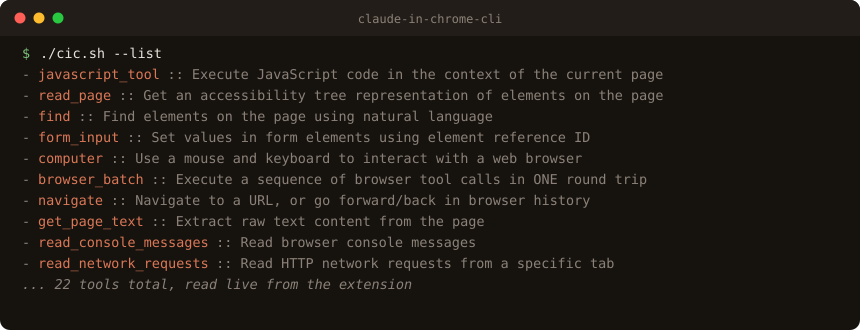

# claude-in-chrome-cli (`cic`)

[](https://www.claudepluginhub.com/plugins/hamzahamidi-claude-in-chrome)
[](https://www.claudepluginhub.com/plugins/hamzahamidi-claude-in-chrome)
[](https://github.com/hamzahamidi/claude-in-chrome-cli/releases)
[](LICENSE)

Use the **Claude in Chrome** extension tools natively in Claude Code, or call them from your shell with `cic.sh`. Both connect through the same MCP server.



## Why

Claude Code ships a stdio MCP server, `claude --claude-in-chrome-mcp`, that bridges to the Claude in Chrome extension. Through it you can drive your **real, logged-in** Chrome: navigate, read the page, click, type, run JavaScript, read the console and network.

Normally you reach those tools from inside a Claude session. Sometimes you just want one from a script or a terminal: a quick navigation, a page-text dump, a one-off step in a shell pipeline. `cic.sh` does that. It speaks the MCP handshake over stdio, calls one tool, prints the result, and exits.

The plugin is a second front door. Install it to make `navigate`, `read_page`, `find`, `computer`, `get_page_text`, and the rest of the extension tools available natively in new Claude Code sessions.

## Requirements

- The **Claude Code CLI** (`claude`) on your PATH.
- The **Claude in Chrome** extension installed and connected to a running Chrome.
- `python3` (parses the JSON-RPC reply; `cic.sh` only).

## Install

### As a Claude Code plugin

```text
/plugin marketplace add hamzahamidi/claude-in-chrome-cli
/plugin install claude-in-chrome@claude-in-chrome-cli
```

New Claude Code sessions get all the extension tools natively, plus a skill ([`using-claude-in-chrome`](skills/using-claude-in-chrome/SKILL.md)) that teaches the agent when to prefer your real session over sessionless browser tools, and how to avoid the common traps.

### As a shell script

```sh
curl -O https://raw.githubusercontent.com/hamzahamidi/claude-in-chrome-cli/main/cic.sh
chmod +x cic.sh
```

## Usage

```sh
./cic.sh --list                                  # list available tools
./cic.sh <tool_name> '<json-args>' [wait_secs]   # call a tool (default wait: 8s)
```

`wait_secs` is how long to wait for the browser to answer before the connection closes. Slow pages or heavy actions need a larger value.

## Examples

```sh
# See what tools the extension exposes
./cic.sh --list

# Open a page in your logged-in Chrome
./cic.sh navigate '{"url":"https://example.com"}'

# Dump the readable text of the current page
./cic.sh get_page_text '{}' 5

# Take a screenshot
./cic.sh computer '{"action":"screenshot"}'

# Run JavaScript in the page
./cic.sh javascript_tool '{"code":"document.title"}'
```

## Tools

The exact set depends on your extension version. Run `./cic.sh --list` for the live list. Common ones:

| Tool | What it does |
| --- | --- |
| `navigate` | Go to a URL, or back/forward |
| `read_page` | Accessibility tree of the page |
| `find` | Find elements by natural language |
| `form_input` | Set values in form fields |
| `computer` | Mouse, keyboard, and screenshots |
| `javascript_tool` | Run JavaScript in the page |
| `get_page_text` | Extract readable text |
| `browser_batch` | Run several tool calls in one round trip |
| `read_console_messages` | Read console logs |
| `read_network_requests` | Read network requests |
| `tabs_context_mcp` / `tabs_create_mcp` / `tabs_close_mcp` | Manage the MCP tab group |
| `list_connected_browsers` / `select_browser` / `switch_browser` | Pick which Chrome to drive |

Argument shapes come from the extension, not from this script. The `--list` output includes each tool's description, which documents its arguments.

## How it works

An MCP stdio server reads newline-delimited JSON-RPC on stdin and writes responses on stdout. `cic.sh` sends three messages, then sleeps to let the reply arrive:

1. `initialize` (the MCP handshake).
2. `notifications/initialized`.
3. `tools/call` (or `tools/list`) with your tool name and arguments, as request id `2`.

It pipes them into `claude --claude-in-chrome-mcp` and reads stdout back. A short `python3` filter picks the reply with id `2` and prints its text content.

Each call is its own stdio session, so nothing persists in the CLI between calls. The **browser** state does persist: navigate in one call, read the page in the next.

## Notes and limits

- It drives your real, logged-in browser. Treat it like handing a script your keyboard.
- No streaming: you get the result after `wait_secs`. Raise it for slow actions.
- One tool per invocation. For sequences, run several calls or use `browser_batch`.

## License

MIT. See [LICENSE](LICENSE).
