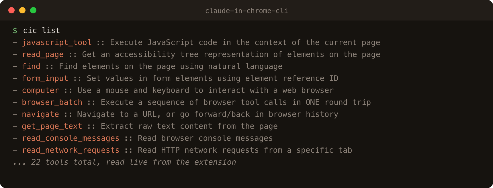

# claude-in-chrome-cli (`cic`)

[](https://www.claudepluginhub.com/plugins/hamzahamidi-claude-in-chrome-plugins-claude-in-chrome)
[](https://www.claudepluginhub.com/plugins/hamzahamidi-claude-in-chrome-plugins-claude-in-chrome)
[](https://www.npmjs.com/package/claude-in-chrome-cli)
[](https://github.com/hamzahamidi/claude-in-chrome-cli/releases)
[](https://codecov.io/github/hamzahamidi/claude-in-chrome-cli)
[](LICENSE)

Use the **Claude in Chrome** extension tools natively in Claude Code, or call them from your shell with `cic`. Both connect through the same MCP server.



## Why

Claude Code ships a stdio MCP server, `claude --claude-in-chrome-mcp`, that bridges to the Claude in Chrome extension. Through it you can drive your **real, logged-in** Chrome: navigate, read the page, click, type, run JavaScript, read the console and network.

Normally you reach those tools from inside a Claude session. Sometimes you just want one from a script or a terminal: a quick navigation, a page-text dump, a one-off step in a shell pipeline. `cic` does that. It speaks the MCP handshake over stdio, calls one tool, prints the result, and exits with a code that means something.

The plugin is a second front door. Install it to make `navigate`, `read_page`, `find`, `computer`, `get_page_text`, and the rest of the extension tools available natively in new Claude Code sessions.

It also adds one tool the extension cannot provide. The bridge only ever sees tabs inside its own tab group, so "what have I got open?" is unanswerable through it. `list_open_tabs` answers it by reading Chrome and Chromium session data from disk, with no debugging port, no extension and no tab group. It lists every tab it can recover from each readable profile and reports encrypted, unsupported or unreadable profiles instead of treating them as empty. Measured on one machine: the bridge could see 4 tabs, `list_open_tabs` saw 29, of which 25 were outside the group. It reads URLs and titles, not page content, and it cannot drive a page.

Where this is going, release by release: see the [roadmap](ROADMAP.md).

## Requirements

- The **Claude Code CLI** (`claude`) on your PATH.
- The **Claude in Chrome** extension installed and connected to a running Chrome for the browser-driving tools. `list_open_tabs` does not need it.
- **Node.js 22 or later**. Nothing else: no runtime dependencies, no `python3`.

## Install

### As a Claude Code plugin

```text
/plugin marketplace add hamzahamidi/claude-in-chrome-cli
/plugin install claude-in-chrome@claude-in-chrome-cli
```

New Claude Code sessions get all the extension tools natively, plus a skill ([`using-claude-in-chrome`](plugins/claude-in-chrome/skills/using-claude-in-chrome/SKILL.md)) that teaches the agent when your real session is the one that matters, which browser tool to reach for when it is not, and how to avoid the common traps. The plugin also bundles the CLI, reachable as `node ${CLAUDE_PLUGIN_ROOT}/bin/cic.js`.

### As a command line tool

```sh
npm install -g claude-in-chrome-cli
```

That puts `cic` on your PATH.

## Usage

```sh
cic list                      # list available tools
cic call <tool> [json-args]   # call a tool, arguments default to {}
```

| Option | What it does |
| --- | --- |
| `--timeout <secs>` | Ceiling on how long to wait for the reply. Default 30. |
| `--retries <n>` | Retry only failures that never reached the browser (exit 3). Default 0. |
| `--json` | Print the raw result object, or one error object, on one line |
| `-h`, `--help` | Usage |
| `-v`, `--version` | Print the version |

`--timeout` is a ceiling, not a wait: `cic` returns the moment the reply lands, so a fast call costs what the browser costs and nothing more.

Exit codes are a contract, frozen from 0.4.0 onward:

| Code | Meaning |
| --- | --- |
| `0` | Success |
| `1` | The tool reported an error (a JSON-RPC error, or `isError: true`) |
| `2` | Outcome unknown: the request was sent and no usable reply came back |
| `3` | Failed before the request was sent, so the browser cannot have acted |
| `64` | Usage error, or invalid arguments JSON |

Only exit 3 is safe to retry automatically, which is the only thing `--retries` will retry. Exit 2 means the click, submit or script may already have run, so repeating it would be a second action rather than a second look at the first.

### One connection, many calls

A one-shot `cic call` pays for a process and a handshake every time, and its tab group starts empty. `cic session --jsonl` holds one connection open and answers one JSON object per line, so a `tabId` from an earlier call is still valid in a later one.

```sh
printf '%s\n' \
  '{"id":1,"tool":"tabs_create_mcp"}' \
  '{"id":2,"tool":"navigate","arguments":{"url":"https://example.com","tabId":123}}' \
  '{"id":3,"tool":"get_page_text","arguments":{"tabId":123}}' \
  | cic session --jsonl
```

| In | Out |
| --- | --- |
| `{"id":<any>,"tool":"<name>","arguments":{...},"timeout":<secs>}` | `{"id":<same>,"exit":0,"result":{...}}` |
| | `{"id":<same>,"error":true,"kind":"...","exit":<code>,"message":"..."}` |

The failure record is the same envelope `cic call --json` already emits, with the id added, so a caller that parses one parses both. `id` is yours: `cic` echoes it back and never invents one. `arguments` defaults to `{}` and `timeout` to the session's.

Calls run one at a time, in the order given, and stdin is paused while one is in flight, so a fast producer cannot build an unbounded backlog. You own sequencing and any value you thread between calls; `cic` owns the connection and nothing else. There are no variables, captures or control flow here on purpose: your program already has those.

Because a persistent process has one exit status and many calls, each record carries its own outcome and the **process** exit code describes only the session: `0` it shut down cleanly, `2` a call whose outcome was unknown ended it, `3` it never started.

A malformed line is that line's problem: it gets a `usage` record and the session continues. A tool error is that call's problem, likewise. **An unknown outcome ends the session**, deliberately: the request was sent, nobody knows whether the browser acted, and letting a later call race it would be the one thing the exit codes exist to prevent. Start a fresh session.

For driving it by hand, `cic shell` is the same connection with a prompt. One line is a tool name and optional JSON arguments, nothing is remembered between lines, and `.exit` or Ctrl-D leaves.

### Moving from `cic.sh`

The shell script is gone as of 0.4.0. It exited 0 on tool errors, so pipelines carried on after a failure, and its `sleep`-based wait was a floor as well as a ceiling. Both are fixed in the Node client rather than patched in shell. The old script stays fetchable from the `v0.2.x` and `v0.3.x` tags.

| Then | Now |
| --- | --- |
| `./cic.sh --list` | `cic list` |
| `./cic.sh navigate '{"url":"..."}'` | `cic call navigate '{"url":"..."}'` |
| `./cic.sh get_page_text '{}' 5` | `cic call get_page_text '{}' --timeout 5` |
| `${CLAUDE_PLUGIN_ROOT}/cic.sh` | `node ${CLAUDE_PLUGIN_ROOT}/bin/cic.js` |
| Third positional argument was the wait | `--timeout`, and it is a ceiling |
| Errors printed, exit 0 | Errors exit 1, 2 or 3, per the table above |

## Examples

```sh
# See what tools the extension exposes
cic list

# Make a tab of your own. It prints "Created new tab. Tab ID: 2099038679"
cic call tabs_create_mcp '{}'

# Then pass that id to every tool that acts on a page
cic call navigate '{"url":"https://example.com","tabId":2099038679}'
cic call get_page_text '{"tabId":2099038679}'
cic call computer '{"action":"screenshot","tabId":2099038679}'
cic call javascript_tool '{"action":"javascript_exec","text":"document.title","tabId":2099038679}'

# Close it when you are done
cic call tabs_close_mcp '{"tabId":2099038679}'
```

Because the exit codes mean something, a sequence can stop when a step fails:

```sh
set -e
TAB=$(cic call tabs_create_mcp '{}' | grep -o '[0-9]\{6,\}')
cic call navigate "{\"url\":\"https://example.com\",\"tabId\":$TAB}"
cic call get_page_text "{\"tabId\":$TAB}"
cic call tabs_close_mcp "{\"tabId\":$TAB}"
```

`tabId` is required here. Each `cic` call is its own MCP session, so the session starts with an empty tab group and a tool that acts on a page answers `No tab available` without one. `list` and `tabs_context_mcp` are the exceptions, since neither touches a page.

Never pass the id of a tab you are working in. `tabs_context_mcp` lists every tab the extension can see, including yours.

## Tools

The exact set depends on your extension version. Run `cic list` for the live list. Common ones:

| Tool | What it does |
| --- | --- |
| `navigate` | Go to a URL, or back/forward |
| `read_page` | Accessibility tree of the page |
| `find` | Find elements by natural language |
| `form_input` | Set values in form fields |
| `computer` | Mouse, keyboard, and screenshots |
| `javascript_tool` | Run JavaScript in the page |
| `get_page_text` | Extract readable text |
| `browser_batch` | Run several tool calls in one round trip |
| `read_console_messages` | Read console logs |
| `read_network_requests` | Read network requests |
| `tabs_context_mcp` / `tabs_create_mcp` / `tabs_close_mcp` | Manage the MCP tab group |
| `list_connected_browsers` / `select_browser` / `switch_browser` | Pick which Chrome to drive |

Argument shapes come from the extension, not from `cic`. The `cic list` output includes each tool's description, which documents its arguments.

One tool does not come from the extension. The plugin ships [`tabs_mcp.js`](plugins/claude-in-chrome/tabs_mcp.js) as a second MCP server, `chrome-tabs`:

| Tool | What it does |
| --- | --- |
| `list_open_tabs` | Tabs recoverable from readable session data across every window and recognized profile |

It takes an optional `profile` to narrow to one Chrome profile, and `include_urls: false` to get counts and hosts without the per-tab list. URLs are redacted by default to origin and path, since a raw URL read straight off disk can carry credentials, a token, a session id or a sensitive query string; pass `full_urls: true` only when the raw URL is actually needed.

The server scans every recognized `Default` and `Profile *` directory for Chrome and Chromium, not just the profile the bridge happens to be using. Profiles whose session storage is encrypted or in an unsupported format are reported, but their tabs cannot be listed. If the newest initial snapshot never completed, the reader falls back to an older trustworthy file; if a completed snapshot only lost later incremental updates, it returns the recovered tabs with an incomplete warning. This is a best-effort reader of Chromium's undocumented SNSS format: it cannot identify the focused tab, and uncommon history-pruning events can leave a tab's reported page stale.

`list_open_tabs` is read only, needs nothing running, and is the answer whenever the question is "what is open" rather than "drive this page". It is not available through `cic`, which talks to the extension bridge instead.

## How it works

An MCP stdio server reads newline-delimited JSON-RPC on stdin and writes responses on stdout. `cic` spawns `claude --claude-in-chrome-mcp` and negotiates in order, as the specification requires:

1. `initialize`, then **wait** for the response and check the agreed protocol version.
2. `notifications/initialized`.
3. `tools/call` (or `tools/list`) with your tool name and arguments, as request id `2`.

It then reads the child's stdout line by line and returns the moment the reply with id `2` lands, so `--timeout` is only a ceiling. The child's stderr passes straight through, which is how a missing binary, a disconnected extension and an auth failure stay distinguishable instead of collapsing into one "no reply" message.

Each call is its own stdio session, so nothing persists in the CLI between calls. The **browser** state does persist: navigate in one call, read the page in the next.

## Notes and limits

- It drives your real, logged-in browser. Treat it like handing a script your keyboard.
- No streaming: you get the whole result at once, as soon as it arrives. Raise `--timeout` for slow actions.
- One tool per invocation. For sequences, run several calls or use `browser_batch`.
- **The tab group is the boundary.** `tabs_context_mcp` lists the tabs in the extension's group and nothing else. No tool pulls another one in: there is no move, no "all windows" flag, and `select_browser` picks a browser rather than a tab. Which window a tab sits in makes no difference. To act on a page you already have open, re-open its URL in a group tab, or add your tab to the group from Chrome's own tab context menu. To merely *list* what you have open, call `list_open_tabs`: it uses the separate `chrome-tabs` server and needs no port, group or extension connection, subject to the readable-profile limitations above.
- **No DevTools protocol.** Navigation, reading and interaction only, so no performance traces, and `navigate` cannot load a `chrome://` URL (it prefixes the scheme).

For CDP work, reach for [`chrome-devtools-mcp`](https://github.com/ChromeDevTools/chrome-devtools-mcp) as it comes. It launches its own Chrome on a profile it keeps between runs (`~/.cache/chrome-devtools-mcp/chrome-profile`), so signing in there once gives you a real session on every later run, with no port open and nothing to enable. Two such servers cannot launch at once: the second answers `The browser is already running for …/chrome-profile`, and `--isolated` is the way out, at the cost of that profile's cookies.

One thing alone needs remote debugging, and that is the tabs you already have open in your daily Chrome. Enable it at `chrome://inspect/#remote-debugging` (Chrome 144 and later) and attach with `--autoConnect`. Not `--browser-url`, whose discovery endpoints answer 404 in that mode, and not `--wsEndpoint`, which pins you to a single browser session. It attaches to your default profile, so any local process reaching the port drives a fully authenticated browser, and the setting persists until you turn it off.

## License

MIT. See [LICENSE](LICENSE).
